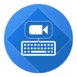

# Meet Shortcuts

A Chrome extension that provides global keyboard shortcuts for Google Meet - control multiple meetings simultaneously, even when Chrome isn't your active window!

## Overview

Meet Shortcuts enhances your Google Meet experience by providing convenient global keyboard shortcuts that work system-wide. Take control of multiple meetings simultaneously with instant access to essential Google Meet functions, even when working in other applications!

## Features

- **Multiple Meeting Support**:
  - Control multiple Meet tabs simultaneously
  - Individual controls for each meeting
  - Quick switching between meetings
  - Automatic tab detection and management

- **Global Shortcuts**: 
  - Control meetings even when Chrome isn't focused
  - Works across all your active Meet tabs
  - Default shortcuts:
    - Toggle microphone (Alt+Shift+U)
    - Toggle camera (Alt+Shift+J)
    - And more customizable options

- **Per-Meeting Controls**:
  - Individual microphone toggle
  - Camera controls
  - Hand raise/lower
  - Captions toggle
  - Reactions panel
  - Quick meeting exit

- **Smart Features**:
  - Zero configuration required
  - Automatic meeting detection
  - Seamless tab management
  - Clean, intuitive interface

- **Privacy & Performance**:
  - No data collection
  - No analytics
  - No external services
  - Lightweight resource usage

## Installation

1. Visit the [Chrome Web Store](https://chrome.google.com/webstore/detail/meet-shortcuts/nfkeopgdjgkefmabpchkebllpjhlkpha)
2. Click "Add to Chrome"
3. The extension will be automatically installed and ready to use

## Usage

1. Join a Google Meet meeting
2. Use the default shortcuts or customize them in Chrome:
   - Go to `chrome://extensions/shortcuts`
   - Find "Meet Shortcuts"
   - Set your preferred key combinations

Default shortcuts:
- `Alt+Shift+U`: Toggle microphone
- `Alt+Shift+J`: Toggle camera
- Other shortcuts are customizable through Chrome's settings

## Contributing

Meet Shortcuts is open source! We welcome contributions to help make it even better.

1. Fork the repository
2. Create your feature branch (`git checkout -b feature/AmazingFeature`)
3. Commit your changes (`git commit -m 'Add some AmazingFeature'`)
4. Push to the branch (`git push origin feature/AmazingFeature`)
5. Open a Pull Request

## Privacy

- Only activates on meet.google.com
- No data collection
- No analytics
- No external services

## License

This project is licensed under the MIT License - see the [LICENSE](LICENSE) file for details.

## Support

Found a bug or have a feature request? [Open an issue](https://github.com/daliovic/meet-shortcuts-extension/issues) on GitHub.

---

Made with ❤️ for the remote work community
